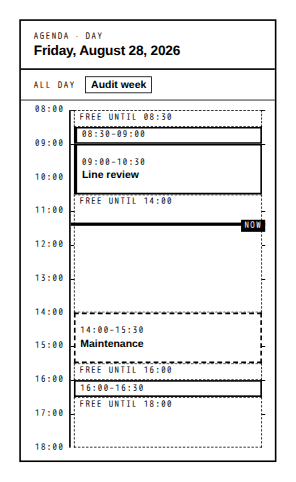

<!-- AUTO-GENERATED by scripts/gen-readmes.mjs from JSDoc + Custom Elements Manifest. DO NOT EDIT. -->

# `<e-agenda>`

Day or week agenda on a proportional time axis, with the gaps between entries shown.

> Source: [agenda.ts](./agenda.ts)

## Attributes

| Attribute | Type | Default | Description |
| --- | --- | --- | --- |
| `date` | `string` | — | Anchor day in `YYYY-MM-DD`. Defaults to the current date. |
| `view` | `'day'\|'week'` | `'day'` | Single day, or the week containing `date`. |
| `events` | `string` | `'[]'` | JSON-encoded array of `{date, title, start?, end?, status?}`. |
| `start-hour` | `number` | `8` | First hour of the visible axis (0–23). |
| `end-hour` | `number` | `18` | Last hour of the visible axis (1–24). |
| `now` | `string` | — | ISO timestamp or `HH:MM` for the "now" marker. Unset hides it. |
| `week-start` | `number` | `1` | First weekday of the week view (0 = Sunday). |
| `min-gap` | `number` | `15` | Shortest free stretch, in minutes, that still gets a label. |
| `hide-gaps` | `boolean` | — | Hides the free-time labels and draws only the entries. |
| `free-label` | `string` | `'Free until'` | Prefix of a free-time label. |
| `all-day-label` | `string` | `'All day'` | Heading of the all-day row. |
| `now-label` | `string` | `'Now'` | Label of the "now" marker. |
| `locale` | `string` | — | Locale for the date headings. Defaults to the document language. |

## Events

_None._

## Slots

_None._
