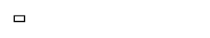

<!-- AUTO-GENERATED by scripts/gen-readmes.mjs from JSDoc + Custom Elements Manifest. DO NOT EDIT. -->

# `<e-badge>`

Inline label badge with an optional inverted color treatment.

Children are used as the badge text.

> Source: [badge.ts](./badge.ts)

## Attributes

| Attribute | Type | Default | Description |
| --- | --- | --- | --- |
| `inverted` | `boolean` | — | Renders the badge with inverted foreground/background. |

## Events

_None._

## Slots

_None._
