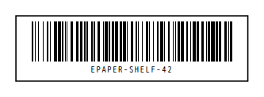

<!-- AUTO-GENERATED by scripts/gen-readmes.mjs from JSDoc + Custom Elements Manifest. DO NOT EDIT. -->

# `<e-barcode>`

Linear barcode (EAN-13, EAN-8, UPC-A, Code 128) rendered as inline SVG.

> Source: [barcode.ts](./barcode.ts)

## Attributes

| Attribute | Type | Default | Description |
| --- | --- | --- | --- |
| `value` | `string` | — | Digits or, for Code 128, any ASCII 32–126 text. |
| `format` | `'auto'\|'ean13'\|'ean8'\|'upca'\|'code128'` | `'auto'` | Symbology. `auto` picks one from the value's shape. |
| `height` | `number` | `80` | Bar height in pixels. |
| `module-width` | `number` | `2` | Width of one narrow bar in pixels. |
| `quiet-zone` | `number` | `10` | Silent margin either side, in modules. |
| `show-text` | `boolean` | — | Prints the human-readable line under the bars. |

## Events

_None._

## Slots

_None._
