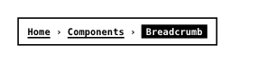

<!-- AUTO-GENERATED by scripts/gen-readmes.mjs from JSDoc + Custom Elements Manifest. DO NOT EDIT. -->

# `<e-breadcrumb>`

Hierarchical navigation trail rendered from `<e-breadcrumb-item>` children.

> Source: [breadcrumb.ts](./breadcrumb.ts)

## Attributes

| Attribute | Type | Default | Description |
| --- | --- | --- | --- |
| `separator` | `string` | `'/'` | Glyph rendered between entries. |

## Events

_None._

## Slots

_None._
