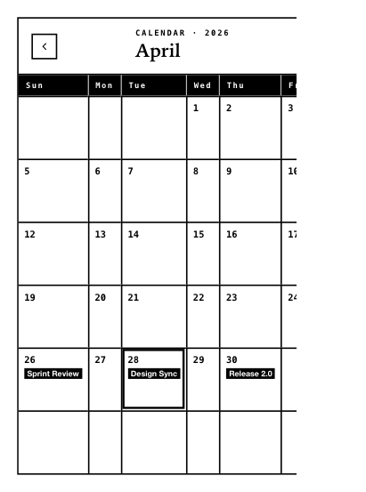

<!-- AUTO-GENERATED by scripts/gen-readmes.mjs from JSDoc + Custom Elements Manifest. DO NOT EDIT. -->

# `<e-calendar>`

Month-grid calendar with selectable day cells and inline event chips.

> Source: [calendar.ts](./calendar.ts)

## Attributes

| Attribute | Type | Default | Description |
| --- | --- | --- | --- |
| `value` | `string` | — | Currently selected day in `YYYY-MM-DD` format. |
| `events` | `string` | `'[]'` | JSON-encoded array of `{date, title}` event objects. |

## Events

| Event | Detail | Description |
| --- | --- | --- |
| `e-change` | `CustomEvent<{value: string}>` | Fired when the user picks a day. `value` is `YYYY-MM-DD`. |

## Slots

_None._
