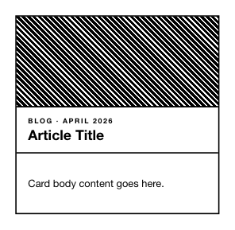

<!-- AUTO-GENERATED by scripts/gen-readmes.mjs from JSDoc + Custom Elements Manifest. DO NOT EDIT. -->

# `<e-card-image>`

Card variant with a top cover area and optional footer slot.

> Source: [card-image.ts](./card-image.ts)

## Attributes

| Attribute | Type | Default | Description |
| --- | --- | --- | --- |
| `title` | `string` | — | Title rendered in the header. |
| `eyebrow` | `string` | — | Small label rendered above the title. |
| `cover` | `string` | — | Cover content. Use `hatch` (or any value starting with `hatch`) for the hatch pattern; otherwise the value is rendered as text. |

## Events

_None._

## Slots

| Slot | Description |
| --- | --- |
| _(default)_ | Default slot for the card body. |
| `footer` | Footer area rendered below the body. |
