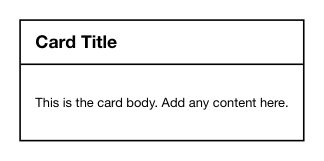

<!-- AUTO-GENERATED by scripts/gen-readmes.mjs from JSDoc + Custom Elements Manifest. DO NOT EDIT. -->

# `<e-card>`

Container with optional eyebrow, title and action area.

> Source: [card.ts](./card.ts)

## Attributes

| Attribute | Type | Default | Description |
| --- | --- | --- | --- |
| `title` | `string` | — | Title rendered in the header. |
| `eyebrow` | `string` | — | Small label rendered above the title. |

## Events

_None._

## Slots

| Slot | Description |
| --- | --- |
| _(default)_ | Default slot for the card body. |
| `action` | Trailing element rendered in the header (e.g. a button). |
