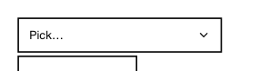

<!-- AUTO-GENERATED by scripts/gen-readmes.mjs from JSDoc + Custom Elements Manifest. DO NOT EDIT. -->

# `<e-cascader>`

Multi-column cascading selector for hierarchical options.

Form-associated: submits the current path joined with `,`.

> Source: [cascader.ts](./cascader.ts)

## Attributes

| Attribute          | Type      | Default     | Description                                                                                                  |
| ------------------ | --------- | ----------- | ------------------------------------------------------------------------------------------------------------ |
| `value`            | `string`  | —           | Comma-separated value path (e.g. `a,b,c`).                                                                   |
| `data`             | `string`  | `'[]'`      | JSON-encoded array of `{value, label, children?}` nodes. Canonical attribute, shared with `<e-tree-select>`. |
| `options`          | `string`  | `'[]'`      | Legacy alias for `data`. When both are set, `data` wins.                                                     |
| `placeholder`      | `string`  | `'Select…'` | Placeholder shown when no value is selected.                                                                 |
| `required`         | `boolean` | —           | Requires a completed selection path.                                                                         |
| `required-message` | `string`  | —           | Message reported when no required path is selected.                                                          |
| `name`             | `string`  | —           | Form field name. Required to participate in `FormData`.                                                      |

## Events

| Event      | Detail                                                     | Description                                                                                                        |
| ---------- | ---------------------------------------------------------- | ------------------------------------------------------------------------------------------------------------------ |
| `e-error`  | `CustomEvent<{error: Error, source: 'data' \| 'options'}>` | Fired when the `data` or `options` attribute fails to parse as JSON. The internal options list falls back to `[]`. |
| `e-change` | `CustomEvent<{value: string[]}>`                           | Fired when a leaf node is selected. `value` is the path of node values.                                            |

## Slots

_None._

## Properties

| Property | Type     | Read-only | Description |
| -------- | -------- | --------- | ----------- |
| `value`  | `string` | no        |             |
