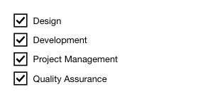

<!-- AUTO-GENERATED by scripts/gen-readmes.mjs from JSDoc + Custom Elements Manifest. DO NOT EDIT. -->

# `<e-checkbox-group>`

Group of checkbox options sharing a single comma-separated value.

Reads options from `<e-cbox-option>` children at connect time.
Form-associated: each selected option is appended to FormData under `name`.

> Source: [checkbox-group.ts](./checkbox-group.ts)

## Attributes

| Attribute          | Type                       | Default      | Description                                               |
| ------------------ | -------------------------- | ------------ | --------------------------------------------------------- |
| `value`            | `string`                   | —            | Comma-separated list of selected option values. Reactive. |
| `layout`           | `'horizontal'\|'vertical'` | `'vertical'` | Stacking direction. Reactive.                             |
| `required`         | `boolean`                  | —            | Requires at least one selected option.                    |
| `required-message` | `string`                   | —            | Message reported when no required option is selected.     |
| `name`             | `string`                   | —            | Form field name. Required to participate in `FormData`.   |

## Events

| Event      | Detail                           | Description                                                                       |
| ---------- | -------------------------------- | --------------------------------------------------------------------------------- |
| `e-change` | `CustomEvent<{value: string[]}>` | Fired when the selection changes. `value` is the array of selected option values. |

## Slots

_None._

## Properties

| Property | Type     | Read-only | Description |
| -------- | -------- | --------- | ----------- |
| `value`  | `string` | no        |             |
