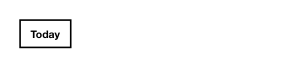

<!-- AUTO-GENERATED by scripts/gen-readmes.mjs from JSDoc + Custom Elements Manifest. DO NOT EDIT. -->

# `<e-chip>`

Selectable label, often used for filters or quick choices.

Children are used as the chip text. A chip toggles `selected` on click and
fires `e-change`. Distinct from `<e-tag>` (which is a removable label) and
`<e-badge>` (which is purely decorative).

> Source: [chip.ts](./chip.ts)

## Attributes

| Attribute | Type | Default | Description |
| --- | --- | --- | --- |
| `selected` | `boolean` | — | Visually marks the chip as active. |
| `disabled` | `boolean` | — | Disables interaction. |

## Events

| Event | Detail | Description |
| --- | --- | --- |
| `e-change` | `CustomEvent<{value: boolean}>` | Fired on click. `value` is the new selected state. |

## Slots

| Slot | Description |
| --- | --- |
| _(default)_ | Default slot for the chip label. |
