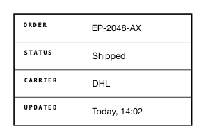

<!-- AUTO-GENERATED by scripts/gen-readmes.mjs from JSDoc + Custom Elements Manifest. DO NOT EDIT. -->

# `<e-description-list>`

Key/value list rendered as a semantic `<dl>` grid.

Reads entries from child `<e-desc-item>` elements at connect time. Each
item contributes a term/detail pair. The grid wraps after `columns`
pairs and supports horizontal (term beside detail) or vertical (term
above detail) layout.

> Source: [description-list.ts](./description-list.ts)

## Attributes

| Attribute | Type | Default | Description |
| --- | --- | --- | --- |
| `columns` | `1\|2\|3\|4` | `1` | Number of pairs per row. |
| `layout` | `'horizontal'\|'vertical'` | `'horizontal'` | Term placement relative to the detail. |
| `bordered` | `boolean` | — | Adds a 2px border and divider lines between pairs. |

## Events

_None._

## Slots

| Slot | Description |
| --- | --- |
| _(default)_ | Default slot for `<e-desc-item>` children. |
