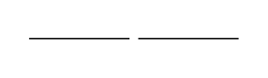

<!-- AUTO-GENERATED by scripts/gen-readmes.mjs from JSDoc + Custom Elements Manifest. DO NOT EDIT. -->

# `<e-divider>`

Visual separator with optional label and orientation.

> Source: [divider.ts](./divider.ts)

## Attributes

| Attribute | Type | Default | Description |
| --- | --- | --- | --- |
| `variant` | `'solid'\|'dashed'` | `'solid'` | Line style. |
| `orientation` | `'horizontal'\|'vertical'` | `'horizontal'` | Layout direction. |
| `label` | `string` | — | Inline label rendered centered on the line (horizontal only). |

## Events

_None._

## Slots

_None._
