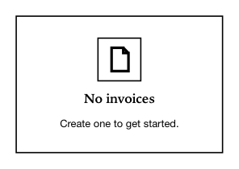

<!-- AUTO-GENERATED by scripts/gen-readmes.mjs from JSDoc + Custom Elements Manifest. DO NOT EDIT. -->

# `<e-empty>`

Empty-state placeholder with optional icon, title, description and action.

Used when a list, table, or section has no content to display.

> Source: [empty.ts](./empty.ts)

## Attributes

| Attribute | Type | Default | Description |
| --- | --- | --- | --- |
| `icon` | `string` | `'doc'` | Icon name from the EPaper icon set. |
| `title` | `string` | `'No data'` | Short headline. |
| `description` | `string` | — | Optional supporting text. |

## Events

_None._

## Slots

| Slot | Description |
| --- | --- |
| `action` | Trailing action area (e.g. a primary button). |
