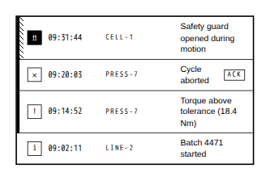

<!-- AUTO-GENERATED by scripts/gen-readmes.mjs from JSDoc + Custom Elements Manifest. DO NOT EDIT. -->

# `<e-event-log>`

Append-only event and alarm list that inserts new rows instead of re-rendering the log.

> Source: [event-log.ts](./event-log.ts)

## Attributes

| Attribute | Type | Default | Description |
| --- | --- | --- | --- |
| `data` | `string` | `'[]'` | JSON-encoded array of `{id, ts, message, severity?, source?, acknowledged?}`. |
| `max-items` | `number` | `50` | Rows kept. Entries beyond it are dropped from the tail of the display order. |
| `order` | `'newest'\|'oldest'` | `'newest'` | Sort direction of the `ts` field. |
| `time-format` | `'time'\|'datetime'` | `'time'` | Whether a row shows the time alone or the full timestamp. |
| `hide-source` | `boolean` | — | Hides the source column. |
| `locale` | `string` | — | Locale for the timestamps. Defaults to the document language. |
| `empty-text` | `string` | `'No events'` | Text shown while the log is empty. |

## Events

_None._

## Slots

_None._

## Properties

| Property | Type | Read-only | Description |
| --- | --- | --- | --- |
| `entries` | `EventLogEntry[]` | yes | The rows currently held, in display order. |
