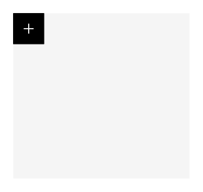

<!-- AUTO-GENERATED by scripts/gen-readmes.mjs from JSDoc + Custom Elements Manifest. DO NOT EDIT. -->

# `<e-float-button>`

Standalone floating action button.

> Source: [float-button.ts](./float-button.ts)

## Attributes

| Attribute | Type | Default | Description |
| --- | --- | --- | --- |
| `icon` | `string` | `'plus'` | Icon name rendered inside the button. |
| `label` | `string` | — | Accessible label. Falls back to the icon name. |
| `primary` | `boolean` | `true` | Primary visual treatment. Set `primary="false"` for the secondary variant. |

## Events

_None._

## Slots

_None._
