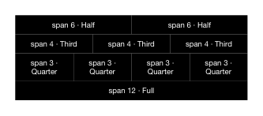

<!-- AUTO-GENERATED by scripts/gen-readmes.mjs from JSDoc + Custom Elements Manifest. DO NOT EDIT. -->

# `<e-grid>`

CSS grid container with attribute-driven columns and gap.

> Source: [grid.ts](./grid.ts)

## Attributes

| Attribute | Type | Default | Description |
| --- | --- | --- | --- |
| `cols` | `string` | `'12'` | Number of equal columns or a raw `grid-template-columns` value. |
| `gap` | `string` | `'0'` | `gap` value. Bare numbers are treated as pixels. |

## Events

_None._

## Slots

_None._
