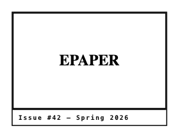

<!-- AUTO-GENERATED by scripts/gen-readmes.mjs from JSDoc + Custom Elements Manifest. DO NOT EDIT. -->

# `<e-image>`

Image with fallback, native lazy-loading and optional caption.

Renders a `<figure>` wrapping an `` (and an optional
`<figcaption>`). When loading fails, the element swaps to the `fallback`
image; if no fallback is provided, an inline placeholder pattern is
rendered instead. `lazy` enables native `loading="lazy"`, which is the
right choice on e-paper because it avoids speculative network fetches
that would otherwise force a full refresh on render.

> Source: [image.ts](./image.ts)

## Attributes

| Attribute | Type | Default | Description |
| --- | --- | --- | --- |
| `src` | `string` | — | Image source URL. |
| `alt` | `string` | — | Alternative text. Required for non-decorative images. |
| `fallback` | `string` | — | URL to load if `src` fails. |
| `caption` | `string` | — | Optional caption rendered below the image. |
| `lazy` | `boolean` | — | Sets `loading="lazy"` on the underlying ``. |
| `width` | `string` | — | Forwarded to the underlying ``. |
| `height` | `string` | — | Forwarded to the underlying ``. |
| `fit` | `'cover'\|'contain'\|'fill'\|'none'` | `'cover'` | CSS object-fit value. |

## Events

| Event | Detail | Description |
| --- | --- | --- |
| `e-load` | `CustomEvent<{value: 'src'\|'fallback'\|'placeholder'}>` | Fires when an image source successfully renders. |
| `e-error` | `CustomEvent<{value: string}>` | Fires when both `src` and `fallback` fail. `value` is the source URL that ultimately failed. |

## Slots

_None._
