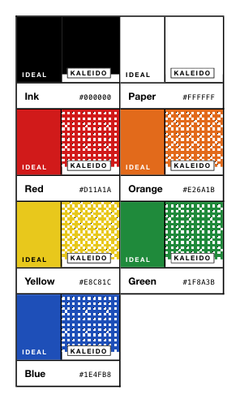

<!-- AUTO-GENERATED by scripts/gen-readmes.mjs from JSDoc + Custom Elements Manifest. DO NOT EDIT. -->

# `<e-kaleido>`

Color palette swatches with Bayer-dithered preview canvases.

> Source: [kaleido.ts](./kaleido.ts)

## Attributes

| Attribute | Type | Default | Description |
| --- | --- | --- | --- |
| `cell` | `number` | `3` | Pixel size of a single dither cell. Smaller values produce a finer pattern. |

## Events

_None._

## Slots

_None._
