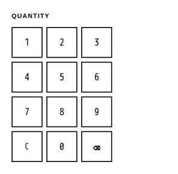

<!-- AUTO-GENERATED by scripts/gen-readmes.mjs from JSDoc + Custom Elements Manifest. DO NOT EDIT. -->

# `<e-keypad>`

On-screen numeric keypad that can drive another control through `for`.

> Source: [keypad.ts](./keypad.ts)

## Attributes

| Attribute | Type | Default | Description |
| --- | --- | --- | --- |
| `value` | `string` | — | Current entry. |
| `for` | `string` | — | Id of the control this keypad types into. |
| `max-length` | `number` | `32` | Longest entry accepted. |
| `decimal` | `boolean` | — | Adds a decimal-separator key. |
| `decimal-separator` | `string` | `'.'` | Character the decimal key inserts. |
| `show-display` | `boolean` | — | Shows the current entry above the keys. |
| `label` | `string` | — | Label rendered above the keypad. |
| `hint` | `string` | — | Helper text rendered below the keypad. |
| `clear-label` | `string` | `'C'` | Text of the clear key. |
| `backspace-label` | `string` | `'⌫'` | Text of the backspace key. |
| `disabled` | `boolean` | — | Disables interaction. Presence alone disables. |
| `required` | `boolean` | — | Requires a non-empty entry. |
| `required-message` | `string` | — | Message reported when `required` is not satisfied. |
| `default-value` | `string` | — | Entry restored by a form reset. |
| `name` | `string` | — | Form field name. Required to participate in `FormData`. |

## Events

| Event | Detail | Description |
| --- | --- | --- |
| `e-change` | `CustomEvent<{value: string}>` | Fired on every key press that changes the entry. |

## Slots

_None._

## Properties

| Property | Type | Read-only | Description |
| --- | --- | --- | --- |
| `value` | `string` | no |  |
| `control` | `(HTMLElement & { value?: string }) \| null` | yes | The control this keypad types into, when `for` names one. |
