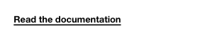

<!-- AUTO-GENERATED by scripts/gen-readmes.mjs from JSDoc + Custom Elements Manifest. DO NOT EDIT. -->

# `<e-link>`

Inline anchor styled with the design-system underline.

Children are used as the link text.

> Source: [link.ts](./link.ts)

## Attributes

| Attribute | Type | Default | Description |
| --- | --- | --- | --- |
| `href` | `string` | `'#'` | Target URL. |

## Events

_None._

## Slots

_None._
