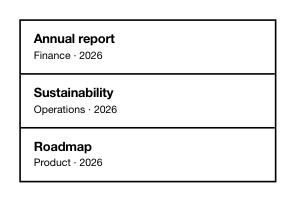

<!-- AUTO-GENERATED by scripts/gen-readmes.mjs from JSDoc + Custom Elements Manifest. DO NOT EDIT. -->

# `<e-list>`

Structured list with header / footer slots and `<e-list-item>` rows.

Different from a native `<ul>` because items are slot-driven (title,
description, leading, trailing) and the container owns the framing.

> Source: [list.ts](./list.ts)

## Attributes

| Attribute | Type | Default | Description |
| --- | --- | --- | --- |
| `bordered` | `boolean` | — | Renders an outer 2 px border. |
| `split` | `boolean` | `true` | Draws a 2 px divider between rows. Set `split="false"` to disable. |
| `header-title` | `string` | — | Optional header text rendered above the rows. |

## Events

_None._

## Slots

| Slot | Description |
| --- | --- |
| _(default)_ | Default slot for `<e-list-item>` children. |
| `header` | Custom header content (replaces `header-title`). |
| `footer` | Footer area. |
