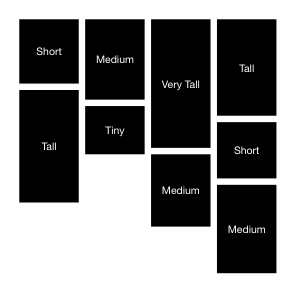

<!-- AUTO-GENERATED by scripts/gen-readmes.mjs from JSDoc + Custom Elements Manifest. DO NOT EDIT. -->

# `<e-masonry>`

CSS-columns based masonry layout for cards of varying height.

CSS selectors apply the configured gap to current and dynamically inserted
children without observers or JavaScript layout reads.

> Source: [masonry.ts](./masonry.ts)

## Attributes

| Attribute | Type | Default | Description |
| --- | --- | --- | --- |
| `columns` | `string` | `'3'` | Number of columns (forwarded to `column-count`). |
| `gap` | `string` | `'16'` | Pixel gap between columns and items. |

## Events

_None._

## Slots

_None._
