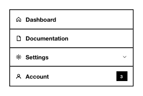

<!-- AUTO-GENERATED by scripts/gen-readmes.mjs from JSDoc + Custom Elements Manifest. DO NOT EDIT. -->

# `<e-menu>`

Hierarchical navigation menu rendered from `<e-menu-item>` children.

> Source: [menu.ts](./menu.ts)

## Attributes

| Attribute | Type | Default | Description |
| --- | --- | --- | --- |
| `mode` | `'horizontal'\|'vertical'` | `'vertical'` | Menu orientation. Reactive. |
| `value` | `string` | — | Currently active item value. Reactive. |

## Events

| Event | Detail | Description |
| --- | --- | --- |
| `e-change` | `CustomEvent<{value: string}>` | Fired when the user activates a leaf item. |

## Slots

_None._
