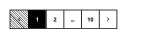

<!-- AUTO-GENERATED by scripts/gen-readmes.mjs from JSDoc + Custom Elements Manifest. DO NOT EDIT. -->

# `<e-pagination>`

Page navigator with previous/next buttons and ellipsized page numbers.

> Source: [pagination.ts](./pagination.ts)

## Attributes

| Attribute | Type | Default | Description |
| --- | --- | --- | --- |
| `current` | `number` | `1` | Current page (1-indexed). Reflected on user navigation. |
| `total` | `number` | `1` | Total number of pages. |
| `sibling-count` | `number` | `1` | Number of sibling pages shown around the current page. |

## Events

| Event | Detail | Description |
| --- | --- | --- |
| `e-change` | `CustomEvent<{value: number}>` | Fired when the user navigates to a different page. `value` is the new 1-indexed page. |

## Slots

_None._
