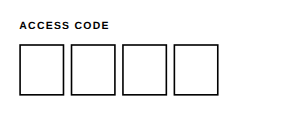

<!-- AUTO-GENERATED by scripts/gen-readmes.mjs from JSDoc + Custom Elements Manifest. DO NOT EDIT. -->

# `<e-pin-input>`

Fixed-length code entry as separate digit boxes, with auto-advance.

> Source: [pin-input.ts](./pin-input.ts)

## Attributes

| Attribute | Type | Default | Description |
| --- | --- | --- | --- |
| `value` | `string` | — | Current code. Longer input is truncated to `length`. |
| `length` | `number` | `4` | Number of digit boxes (1–12). |
| `masked` | `boolean` | — | Hides the entered digits, as a PIN pad does. |
| `label` | `string` | — | Label rendered above the boxes. |
| `hint` | `string` | — | Helper text rendered below the boxes. |
| `disabled` | `boolean` | — | Disables interaction. Presence alone disables. |
| `required` | `boolean` | — | Requires every box to be filled. |
| `required-message` | `string` | — | Message reported when `required` is not satisfied. |
| `default-value` | `string` | — | Code restored by a form reset. |
| `name` | `string` | — | Form field name. Required to participate in `FormData`. |

## Events

| Event | Detail | Description |
| --- | --- | --- |
| `e-input` | `CustomEvent<{value: string}>` | Fired on every digit typed or deleted. |
| `e-change` | `CustomEvent<{value: string}>` | Fired once the last box is filled. |

## Slots

_None._

## Properties

| Property | Type | Read-only | Description |
| --- | --- | --- | --- |
| `value` | `string` | no |  |
