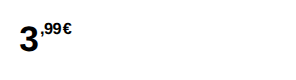

<!-- AUTO-GENERATED by scripts/gen-readmes.mjs from JSDoc + Custom Elements Manifest. DO NOT EDIT. -->

# `<e-price>`

Retail price with split euro/cent typography, strike-through original and base price.

> Source: [price.ts](./price.ts)

## Attributes

| Attribute | Type | Default | Description |
| --- | --- | --- | --- |
| `value` | `number` | — | Current price. |
| `currency` | `string` | `'EUR'` | ISO 4217 currency code. |
| `locale` | `string` | — | Formatting locale. Defaults to the document language. |
| `original` | `number` | — | Previous price, rendered struck through above the current one. |
| `unit-price` | `number` | — | Base price per `unit`, rendered as a footnote. |
| `unit` | `string` | — | Base-price unit, e.g. `kg` or `l`. |
| `fraction-digits` | `number` | — | Overrides the currency's own number of decimals. |
| `size` | `'xs'\|'sm'\|'md'\|'lg'\|'xl'` | `'md'` | Type scale, from a 1.5" label (`xs`) to a 10" panel (`xl`). |
| `note` | `string` | — | Small print under the price, e.g. `incl. VAT`. |
| `original-label` | `string` | `'Was'` | Screen-reader prefix of the struck-through price. |

## Events

_None._

## Slots

_None._
