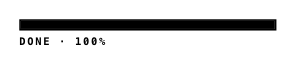

<!-- AUTO-GENERATED by scripts/gen-readmes.mjs from JSDoc + Custom Elements Manifest. DO NOT EDIT. -->

# `<e-progress>`

Static progress indicator (linear bar or discrete steps).

No animation: the bar updates as a single dirty rectangle which the EPDC
can resolve with a partial waveform.

> Source: [progress.ts](./progress.ts)

## Attributes

| Attribute | Type | Default | Description |
| --- | --- | --- | --- |
| `value` | `number` | `0` | Current value (0..max). |
| `max` | `number` | `100` | Maximum value. |
| `variant` | `'linear'\|'steps'` | `'linear'` | Visual style. |
| `steps` | `number` | `5` | When `variant="steps"`, the number of segments. |
| `label` | `string` | — | Accessible label, also rendered as a small caption. |
| `hide-label` | `boolean` | — | Suppresses the visible caption while keeping the aria-label. |

## Events

_None._

## Slots

_None._
