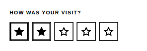

<!-- AUTO-GENERATED by scripts/gen-readmes.mjs from JSDoc + Custom Elements Manifest. DO NOT EDIT. -->

# `<e-rating>`

Star or smiley rating with touch-sized targets and full keyboard control.

> Source: [rating.ts](./rating.ts)

## Attributes

| Attribute | Type | Default | Description |
| --- | --- | --- | --- |
| `value` | `number` | `0` | Current rating. `0` means unrated. |
| `max` | `number` | `5` | Number of symbols (1–10). |
| `glyph` | `'star'\|'smiley'` | `'star'` | Symbol drawn for each step. |
| `label` | `string` | — | Label rendered above the symbols. |
| `hint` | `string` | — | Helper text rendered below the symbols. |
| `readonly` | `boolean` | — | Renders the current rating without accepting input. |
| `disabled` | `boolean` | — | Disables interaction. Presence alone disables. |
| `required` | `boolean` | — | Requires a rating of at least 1. |
| `required-message` | `string` | — | Message reported when `required` is not satisfied. |
| `allow-clear` | `boolean` | — | Re-selecting the current rating clears it back to `0`. |
| `default-value` | `number` | — | Rating restored by a form reset. |
| `name` | `string` | — | Form field name. Required to participate in `FormData`. |

## Events

| Event | Detail | Description |
| --- | --- | --- |
| `e-change` | `CustomEvent<{value: number}>` | Fired when the rating changes. |

## Slots

_None._

## Properties

| Property | Type | Read-only | Description |
| --- | --- | --- | --- |
| `value` | `number` | no |  |
