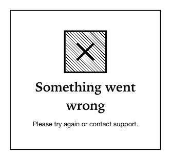

<!-- AUTO-GENERATED by scripts/gen-readmes.mjs from JSDoc + Custom Elements Manifest. DO NOT EDIT. -->

# `<e-result>`

Status page block (success / error / 404 / info / warning).

Use as the body of a confirmation page or an error fallback. Composes an
icon, a large title, optional description and a slotted action area.

> Source: [result.ts](./result.ts)

## Attributes

| Attribute | Type | Default | Description |
| --- | --- | --- | --- |
| `status` | `'success'\|'error'\|'warning'\|'info'\|'404'` | `'info'` | Status preset; controls the icon. |
| `title` | `string` | — | Headline. |
| `description` | `string` | — | Supporting text. |

## Events

_None._

## Slots

| Slot | Description |
| --- | --- |
| `action` | Trailing action area (e.g. one or two buttons). |
