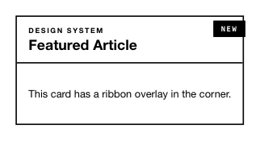

<!-- AUTO-GENERATED by scripts/gen-readmes.mjs from JSDoc + Custom Elements Manifest. DO NOT EDIT. -->

# `<e-ribbon>`

Decorative ribbon tag overlaid on a child element.

Children are wrapped and decorated with the ribbon tag.

> Source: [ribbon.ts](./ribbon.ts)

## Attributes

| Attribute | Type | Default | Description |
| --- | --- | --- | --- |
| `text` | `string` | — | Text shown inside the ribbon tag. |

## Events

_None._

## Slots

_None._
