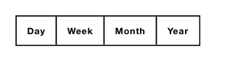

<!-- AUTO-GENERATED by scripts/gen-readmes.mjs from JSDoc + Custom Elements Manifest. DO NOT EDIT. -->

# `<e-segmented>`

Single-select toggle row built from `<e-segment>` children.

> Source: [segmented.ts](./segmented.ts)

## Attributes

| Attribute | Type | Default | Description |
| --- | --- | --- | --- |
| `value` | `string` | — | Currently selected segment value. Reactive. |

## Events

| Event | Detail | Description |
| --- | --- | --- |
| `e-change` | `CustomEvent<{value: string}>` | Fired when the user picks a different segment. |

## Slots

_None._
