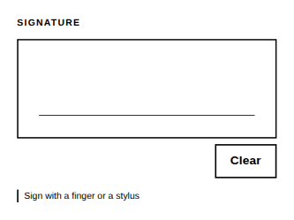

<!-- AUTO-GENERATED by scripts/gen-readmes.mjs from JSDoc + Custom Elements Manifest. DO NOT EDIT. -->

# `<e-signature>`

Handwritten signature captured on a canvas and submitted as a PNG file.

> Source: [signature.ts](./signature.ts)

## Attributes

| Attribute | Type | Default | Description |
| --- | --- | --- | --- |
| `width` | `number` | `480` | Canvas backing width in pixels. |
| `height` | `number` | `180` | Canvas backing height in pixels. |
| `pen-width` | `number` | `3` | Stroke width in canvas pixels. |
| `label` | `string` | — | Label rendered above the pad. |
| `hint` | `string` | — | Helper text rendered below the pad. |
| `clear-label` | `string` | `'Clear'` | Text of the clear button. |
| `fallback-text` | `string` | — | Shown instead of the pad when the browser has no 2D canvas. |
| `readonly` | `boolean` | — | Shows the current signature without accepting input. |
| `disabled` | `boolean` | — | Disables interaction. Presence alone disables. |
| `required` | `boolean` | — | Requires a signature before the form validates. |
| `required-message` | `string` | — | Message reported when `required` is not satisfied. |
| `name` | `string` | — | Form field name. Required to participate in `FormData`. |

## Events

| Event | Detail | Description |
| --- | --- | --- |
| `e-change` | `CustomEvent<{value: string}>` | Fired when a stroke ends or the pad is cleared. `value` is a PNG data URL, or `''` when empty. |

## Slots

_None._

## Properties

| Property | Type | Read-only | Description |
| --- | --- | --- | --- |
| `value` | `string` | no |  |
| `empty` | `boolean` | yes | True while the pad holds a signature. |
