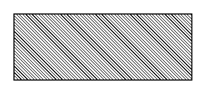

<!-- AUTO-GENERATED by scripts/gen-readmes.mjs from JSDoc + Custom Elements Manifest. DO NOT EDIT. -->

# `<e-skeleton>`

Static loading placeholder block.

Pure outline — no shimmer, no animation. Use to reserve space for content
that is loading. On e-paper this avoids triggering a full GC16 refresh
when the real content arrives.

> Source: [skeleton.ts](./skeleton.ts)

## Attributes

| Attribute | Type | Default | Description |
| --- | --- | --- | --- |
| `shape` | `'block'\|'text'\|'circle'` | `'block'` | Geometry of the placeholder. |
| `lines` | `number` | `1` | When `shape="text"`, the number of stacked lines. |
| `width` | `string` | — | CSS width (e.g. `100%`, `12rem`). Defaults per shape. |
| `height` | `string` | — | CSS height. Defaults per shape. |

## Events

_None._

## Slots

_None._
