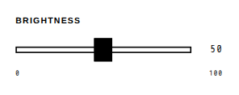

<!-- AUTO-GENERATED by scripts/gen-readmes.mjs from JSDoc + Custom Elements Manifest. DO NOT EDIT. -->

# `<e-slider>`

Range slider with a wide grip, printed scale and optional tick marks.

> Source: [slider.ts](./slider.ts)

## Attributes

| Attribute | Type | Default | Description |
| --- | --- | --- | --- |
| `value` | `number` | — | Current value. Falls back to `default-value`, then to `min`. |
| `min` | `number` | `0` | Lower bound. |
| `max` | `number` | `100` | Upper bound. |
| `step` | `number` | `1` | Step interval. |
| `ticks` | `number` | — | Number of tick intervals drawn under the track (2–20). Omit for none. |
| `label` | `string` | — | Label rendered above the track. |
| `hint` | `string` | — | Helper text rendered below the track. |
| `unit` | `string` | — | Unit appended to the printed value, e.g. `°C`. |
| `hide-value` | `boolean` | — | Hides the printed value readout. |
| `hide-scale` | `boolean` | — | Hides the min/max end labels. |
| `disabled` | `boolean` | — | Disables interaction. Presence alone disables. |
| `default-value` | `number` | — | Value restored by a form reset. |
| `name` | `string` | — | Form field name. Required to participate in `FormData`. |

## Events

| Event | Detail | Description |
| --- | --- | --- |
| `type` | `CustomEvent` |  |
| `e-input` | `CustomEvent<{value: number}>` | Fired continuously while dragging. |
| `e-change` | `CustomEvent<{value: number}>` | Fired when the value is committed. |

## Slots

_None._

## Properties

| Property | Type | Read-only | Description |
| --- | --- | --- | --- |
| `value` | `number` | no |  |
