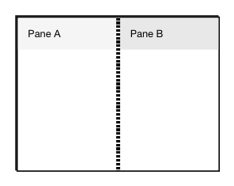

<!-- AUTO-GENERATED by scripts/gen-readmes.mjs from JSDoc + Custom Elements Manifest. DO NOT EDIT. -->

# `<e-splitter>`

Two-pane resizable splitter with mouse and keyboard support.

> Source: [splitter.ts](./splitter.ts)

## Attributes

| Attribute | Type | Default | Description |
| --- | --- | --- | --- |
| `orientation` | `'horizontal'\|'vertical'` | `'horizontal'` | Layout direction. Horizontal places panes side by side; vertical stacks them. |
| `initial` | `number` | `50` | Initial size of pane `a` as a percentage. |
| `min` | `number` | `15` | Minimum percentage for pane `a`. |
| `max` | `number` | `85` | Maximum percentage for pane `a`. |

## Events

_None._

## Slots

| Slot | Description |
| --- | --- |
| `a` | Content for the first pane. |
| `b` | Content for the second pane. |
