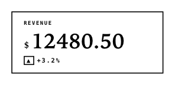

<!-- AUTO-GENERATED by scripts/gen-readmes.mjs from JSDoc + Custom Elements Manifest. DO NOT EDIT. -->

# `<e-statistic>`

KPI block with a large numeric value, label and optional trend arrow.

Use to present a single metric (e.g. revenue, users, score) with an
optional secondary delta. Numeric formatting is locale-independent and
respects the `precision` attribute. The trend marker is a static glyph,
not animated, so it is e-paper-friendly.

> Source: [statistic.ts](./statistic.ts)

## Attributes

| Attribute | Type | Default | Description |
| --- | --- | --- | --- |
| `label` | `string` | — | Caption above the value. |
| `value` | `string\|number` | — | Primary value. Strings render as-is; numbers honor `precision`. |
| `prefix` | `string` | — | Inline prefix rendered before the value (e.g. `$`). |
| `suffix` | `string` | — | Inline suffix rendered after the value (e.g. `%`). |
| `precision` | `number` | — | Decimal places when `value` is numeric. |
| `trend` | `'up'\|'down'\|'flat'` | — | Direction marker shown next to the delta. |
| `delta` | `string\|number` | — | Secondary value rendered next to the trend arrow. |

## Events

_None._

## Slots

_None._
