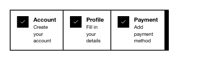

<!-- AUTO-GENERATED by scripts/gen-readmes.mjs from JSDoc + Custom Elements Manifest. DO NOT EDIT. -->

# `<e-steps>`

Numbered or check-marked step list rendered from `<e-step>` children.

> Source: [steps.ts](./steps.ts)

## Attributes

| Attribute | Type | Default | Description |
| --- | --- | --- | --- |
| `current` | `number` | `0` | Index of the active step (0-based). Reactive. |
| `orientation` | `'horizontal'\|'vertical'` | `'horizontal'` | Layout direction. Reactive. |

## Events

_None._

## Slots

_None._
