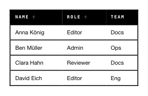

<!-- AUTO-GENERATED by scripts/gen-readmes.mjs from JSDoc + Custom Elements Manifest. DO NOT EDIT. -->

# `<e-table>`

Data grid with header, optional sort and row-selection.

Sort is **static**: clicking the header toggles `none → asc → desc → none`
and emits `e-sort`. The component never re-orders rows itself — owners
decide whether to re-fetch or sort client-side. This keeps e-paper
refreshes deterministic.

> Source: [table.ts](./table.ts)

## Attributes

| Attribute | Type | Default | Description |
| --- | --- | --- | --- |
| `columns` | `string` | — | JSON array of column definitions: `[{key, title, sortable?, align?, width?}]`. |
| `data` | `string` | — | JSON array of row objects keyed by `column.key`. |
| `selectable` | `boolean` | — | Renders a leading column of row checkboxes. |
| `selected` | `string` | — | Comma-separated row indices (0-based) that appear selected. |
| `sort` | `string` | — | Current sort indicator as `key:asc` or `key:desc`. Reflects on header click. |
| `empty-text` | `string` | `'No data'` | Caption for the empty state. |

## Events

| Event | Detail | Description |
| --- | --- | --- |
| `e-sort` | `CustomEvent<{key: string, direction: 'asc'\|'desc'\|'none'}>` | Header sort button clicked. |
| `e-select` | `CustomEvent<{value: number[]}>` | Row selection changed. `value` is the new list of selected indices. |

## Slots

_None._
