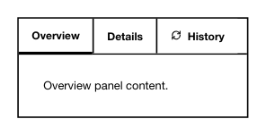

<!-- AUTO-GENERATED by scripts/gen-readmes.mjs from JSDoc + Custom Elements Manifest. DO NOT EDIT. -->

# `<e-tabs>`

Tab strip with persistent panels rendered from `<e-tab>` children.

All panels are built once at connect time and toggled with `hidden` on
tab switch — nested Custom Elements (form controls etc.) keep their state.

> Source: [tabs.ts](./tabs.ts)

## Attributes

| Attribute | Type | Default | Description |
| --- | --- | --- | --- |
| `default-value` | `string` | — | Key of the tab active on first render. Defaults to the first tab. |

## Events

| Event | Detail | Description |
| --- | --- | --- |
| `e-change` | `CustomEvent<{value: string}>` | Fired when the user activates a different tab. `value` is the activated tab's `key`. |

## Slots

_None._
