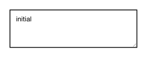

<!-- AUTO-GENERATED by scripts/gen-readmes.mjs from JSDoc + Custom Elements Manifest. DO NOT EDIT. -->

# `<e-textarea>`

Multi-line text input with error and disabled states.

Form-associated: participates in `<form>` submission and FormData.

> Source: [textarea.ts](./textarea.ts)

## Attributes

| Attribute          | Type      | Default | Description                                                                                                                                         |
| ------------------ | --------- | ------- | --------------------------------------------------------------------------------------------------------------------------------------------------- |
| `value`            | `string`  | —       | Current value.                                                                                                                                      |
| `error`            | `boolean` | —       | Marks the textarea as invalid. Sets `aria-invalid="true"` and a custom `ElementInternals` validity error so `form.checkValidity()` returns `false`. |
| `error-message`    | `string`  | —       | Message reported to `ElementInternals.setValidity` when `error` is set. Defaults to "Invalid value.".                                               |
| `disabled`         | `boolean` | —       | Disables interaction.                                                                                                                               |
| `readonly`         | `boolean` | —       | Renders as a non-editable read-only textarea. Still submitted with the form.                                                                        |
| `aria-label`       | —         | —       |                                                                                                                                                     |
| `placeholder`      | `string`  | —       | Native placeholder text.                                                                                                                            |
| `required`         | `boolean` | —       | Requires a non-empty value for form validation.                                                                                                     |
| `required-message` | `string`  | —       | Overrides the native message reported when `required` is not satisfied.                                                                             |
| `minlength`        | `number`  | —       | Minimum text length.                                                                                                                                |
| `maxlength`        | `number`  | —       | Maximum text length.                                                                                                                                |
| `name`             | `string`  | —       | Form field name. Required to participate in `FormData`.                                                                                             |

## Events

| Event      | Detail                         | Description                     |
| ---------- | ------------------------------ | ------------------------------- |
| `e-input`  | `CustomEvent<{value: string}>` | Fired on every keystroke.       |
| `e-change` | `CustomEvent<{value: string}>` | Fired on commit (blur / Enter). |

## Slots

_None._

## Properties

| Property | Type     | Read-only | Description |
| -------- | -------- | --------- | ----------- |
| `value`  | `string` | no        |             |
