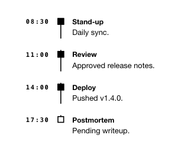

<!-- AUTO-GENERATED by scripts/gen-readmes.mjs from JSDoc + Custom Elements Manifest. DO NOT EDIT. -->

# `<e-timeline>`

Vertical list of timestamped events with marker bullets.

Reads its entries from child `<e-timeline-item>` elements at connect time.
Items are rendered as `<li>` rows with a marker, time label, title and
default-slot body. Layout is fully static — there are no animations.

> Source: [timeline.ts](./timeline.ts)

## Attributes

| Attribute | Type | Default | Description |
| --- | --- | --- | --- |
| `time-position` | `'left'\|'right'` | `'left'` | Side of the rail where the timestamp is rendered. |

## Events

_None._

## Slots

| Slot | Description |
| --- | --- |
| _(default)_ | Default slot for `<e-timeline-item>` children. |
