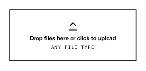

<!-- AUTO-GENERATED by scripts/gen-readmes.mjs from JSDoc + Custom Elements Manifest. DO NOT EDIT. -->

# `<e-upload>`

Drop-zone file picker with live file list and per-file removal.

Form-associated: holds real `File` objects and submits them through
`ElementInternals.setFormValue`. In multi-file mode each file is appended
to a `FormData` under `name`; in single-file mode the lone `File` is
submitted directly.

> Source: [upload.ts](./upload.ts)

## Attributes

| Attribute          | Type      | Default | Description                                                                                               |
| ------------------ | --------- | ------- | --------------------------------------------------------------------------------------------------------- |
| `accept`           | `string`  | —       | Comma-separated MIME types or extensions forwarded to the underlying file input.                          |
| `multiple`         | `boolean` | —       | Accept more than one file. When absent, picking a new file replaces the prior one.                        |
| `max-size`         | `string`  | —       | Maximum size per file in bytes. Files exceeding the limit are rejected and the control is marked invalid. |
| `max-files`        | `string`  | —       | Maximum number of files allowed in multi-file mode.                                                       |
| `required`         | `boolean` | —       | Requires at least one selected file.                                                                      |
| `required-message` | `string`  | —       | Message reported when no required file is selected.                                                       |
| `name`             | `string`  | —       | Form field name. Required to participate in `FormData`.                                                   |

## Events

| Event      | Detail                         | Description                                                    |
| ---------- | ------------------------------ | -------------------------------------------------------------- |
| `e-change` | `CustomEvent<{files: File[]}>` | Fired whenever the selected file list changes (add or remove). |

## Slots

_None._

## Properties

| Property | Type     | Read-only | Description |
| -------- | -------- | --------- | ----------- |
| `_value` | `File[]` | no        |             |
| `value`  | `File[]` | no        |             |
