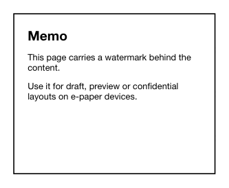

<!-- AUTO-GENERATED by scripts/gen-readmes.mjs from JSDoc + Custom Elements Manifest. DO NOT EDIT. -->

# `<e-watermark>`

Repeating background watermark for the host's content area.

Renders an SVG-based, tiled watermark behind slotted children. Designed
for ownership/draft labels on printable e-paper layouts. The pattern is
a single SVG `<text>` element repeated via CSS `background-image`, which
means it scales sharply on Kaleido panels without dithering.

> Source: [watermark.ts](./watermark.ts)

## Attributes

| Attribute | Type | Default | Description |
| --- | --- | --- | --- |
| `content` | `string` | — | Text to render on the watermark layer. |
| `font-size` | `number` | `16` | SVG font size in pixels. |
| `gap-x` | `number` | `120` | Horizontal tile size. |
| `gap-y` | `number` | `80` | Vertical tile size. |
| `rotate` | `number` | `-22` | Rotation of the text in degrees. |
| `opacity` | `number` | `0.18` | Watermark opacity, 0 to 1. |

## Events

_None._

## Slots

| Slot | Description |
| --- | --- |
| _(default)_ | Content rendered above the watermark layer. |
