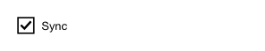

<!-- AUTO-GENERATED by scripts/gen-readmes.mjs from JSDoc + Custom Elements Manifest. DO NOT EDIT. -->

# `<e-checkbox>`

Single checkbox with an optional inline label.

Form-associated: submits its `value` (defaults to `"on"`) when checked,
matching native `<input type="checkbox">` behaviour.

> Source: [checkbox.ts](./checkbox.ts)

## Attributes

| Attribute | Type | Default | Description |
| --- | --- | --- | --- |
| `checked` | `boolean` | — | Whether the box is checked. Reflected to the attribute on user input. |
| `label` | `string` | — | Inline text label rendered next to the box. |
| `disabled` | `boolean` | — | Disables interaction. |
| `name` | `string` | — | Form field name. Required to participate in `FormData`. |
| `value` | `string` | `'on'` | Submitted value when checked. |

## Events

| Event | Detail | Description |
| --- | --- | --- |
| `e-change` | `CustomEvent<{checked: boolean}>` | Fired when the checked state changes. |

## Slots

_None._

## Properties

| Property | Type | Read-only | Description |
| --- | --- | --- | --- |
| `checked` | `boolean` | no |  |
| `value` | `string` | no | Submitted value when checked (defaults to "on"). |
