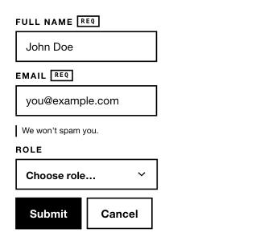

<!-- AUTO-GENERATED by scripts/gen-readmes.mjs from JSDoc + Custom Elements Manifest. DO NOT EDIT. -->

# `<e-form>`

Form wrapper that intercepts `submit` and re-fires it as `e-submit`.

> Source: [form.ts](./form.ts)

## Attributes

| Attribute | Type | Default | Description |
| --- | --- | --- | --- |
| `layout` | `'inline'` | — | Set to `inline` to render fields on one line. |

## Events

| Event | Detail | Description |
| --- | --- | --- |
| `e-submit` | `CustomEvent<{form: EventTarget}>` | Fired when the inner form is submitted; the native submit is `preventDefault`-ed. |

## Slots

_None._
