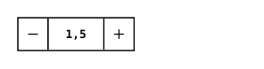

<!-- AUTO-GENERATED by scripts/gen-readmes.mjs from JSDoc + Custom Elements Manifest. DO NOT EDIT. -->

# `<e-input-number>`

Numeric input with increment/decrement buttons.

Form-associated: the value is submitted as a string (matching the behaviour
of `<input type="number">`). Step buttons support press-and-hold to repeat.

> Source: [input-number.ts](./input-number.ts)

## Attributes

| Attribute | Type | Default | Description |
| --- | --- | --- | --- |
| `value` | `string` | — | Current numeric value as a string. |
| `min` | `string` | — | Lower bound (inclusive). |
| `max` | `string` | — | Upper bound (inclusive). |
| `step` | `string` | `'1'` | Step size for the buttons and native input. |
| `default-value` | `string` | — | Initial value used by `formResetCallback`. |
| `name` | `string` | — | Form field name. Required to participate in `FormData`. |

## Events

| Event | Detail | Description |
| --- | --- | --- |
| `e-change` | `CustomEvent<{value: number}>` | Fired when the value changes via buttons or native commit. |

## Slots

_None._

## Properties

| Property | Type | Read-only | Description |
| --- | --- | --- | --- |
| `value` | `string` | no |  |
