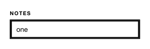

<!-- AUTO-GENERATED by scripts/gen-readmes.mjs from JSDoc + Custom Elements Manifest. DO NOT EDIT. -->

# `<e-input>`

Single-line text input with label, hint and error states.

Form-associated: participates in `<form>` submission and FormData.

> Source: [input.ts](./input.ts)

## Attributes

| Attribute | Type | Default | Description |
| --- | --- | --- | --- |
| `value` | `string` | — | Current value. Reflected via the `value` property. |
| `error` | `boolean` | — | Marks the input as invalid. Sets `aria-invalid="true"` and a custom `ElementInternals` validity error so `form.checkValidity()` returns `false`. |
| `error-message` | `string` | — | Message reported to `ElementInternals.setValidity` when `error` is set. Defaults to "Invalid value.". |
| `disabled` | `boolean` | — | Disables interaction. |
| `readonly` | `boolean` | — | Renders as a non-editable read-only input. Still submitted with the form. |
| `aria-label` | — | — |  |
| `placeholder` | `string` | — | Native placeholder text. |
| `label` | `string` | — | Label rendered above the input. |
| `hint` | `string` | — | Helper text rendered below the input. |
| `type` | `string` | `'text'` | Native input type. |
| `default-value` | `string` | — | Initial value used when `value` is not set. |
| `name` | `string` | — | Form field name. Required to participate in `FormData`. |

## Events

| Event | Detail | Description |
| --- | --- | --- |
| `e-input` | `CustomEvent<{value: string}>` | Fired on every keystroke. |
| `e-change` | `CustomEvent<{value: string}>` | Fired on commit (blur/Enter). |

## Slots

_None._

## Properties

| Property | Type | Read-only | Description |
| --- | --- | --- | --- |
| `value` | `string` | no |  |
