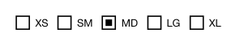

<!-- AUTO-GENERATED by scripts/gen-readmes.mjs from JSDoc + Custom Elements Manifest. DO NOT EDIT. -->

# `<e-radio-group>`

Group of radio options sharing a single value.

Reads options from `<e-radio>` children at connect time.
Form-associated: participates in `<form>` submission and FormData.

> Source: [radio-group.ts](./radio-group.ts)

## Attributes

| Attribute | Type | Default | Description |
| --- | --- | --- | --- |
| `value` | `string` | — | Currently selected option value. |
| `layout` | `'horizontal'\|'vertical'` | `'horizontal'` | Stacking direction. |
| `name` | `string` | — | Form field name. Required to participate in `FormData`. |

## Events

| Event | Detail | Description |
| --- | --- | --- |
| `e-change` | `CustomEvent<{value: string}>` | Fired when the selection changes. |

## Slots

_None._

## Properties

| Property | Type | Read-only | Description |
| --- | --- | --- | --- |
| `value` | `string` | no |  |
