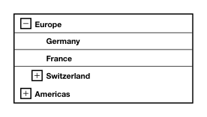

<!-- AUTO-GENERATED by scripts/gen-readmes.mjs from JSDoc + Custom Elements Manifest. DO NOT EDIT. -->

# `<e-tree-select>`

Single-select hierarchical tree with expand/collapse controls.

Form-associated: submits the selected node's value.

> Source: [tree-select.ts](./tree-select.ts)

## Attributes

| Attribute | Type | Default | Description |
| --- | --- | --- | --- |
| `value` | `string` | — | Currently selected node value. |
| `data` | `string` | `'[]'` | JSON-encoded array of `{value, label, children?}` nodes. Canonical attribute, shared with `<e-cascader>`. |
| `options` | `string` | `'[]'` | Alias for `data` for symmetry with `<e-cascader>`. When both are set, `data` wins. |
| `name` | `string` | — | Form field name. Required to participate in `FormData`. |
| `default-expanded` | `string` | — | Comma-separated list of node values that are expanded on first render. |

## Events

| Event | Detail | Description |
| --- | --- | --- |
| `e-error` | `CustomEvent<{error: Error, source: 'data' \| 'options'}>` | Fired when the `data` or `options` attribute fails to parse as JSON. The internal tree falls back to `[]`. |
| `e-change` | `CustomEvent<{value: string}>` | Fired when the user selects a node. `value` is the node's value. |

## Slots

_None._

## Properties

| Property | Type | Read-only | Description |
| --- | --- | --- | --- |
| `value` | `string` | no |  |
